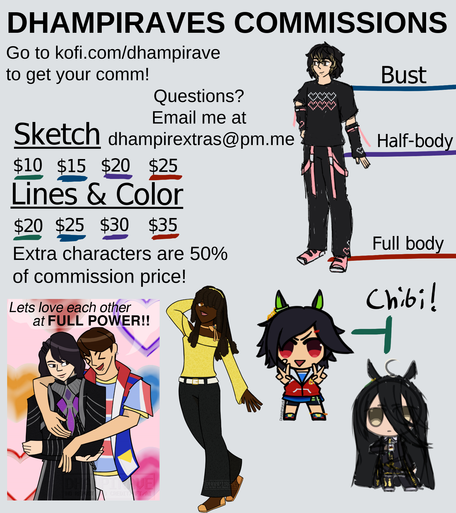

<section class="basicbox">
        
    

        

            Welcome to DHAMPIRAVE, the website for all things relating to me! Here you will find what music I like, my artwork, my 'shrines' dedicated to my interests, and many many more things.  
            The site was made on a 1920x1080 screen and is intended for desktop, however, this site is mobile responsive! While I try to keep this site as clean as possible, I would reccomend anyone under the age of 16 to stay away from the site.
        

        

        
        
Pages will be re-added eventually!

    

</section>

<section class="area2">
    

        ill put a blog/rss feed here eventually lol
    

    

        Comissions open! check my <a href="https://ko-fi.com/dhampirave">ko-fi</a>! 
        
    

    

        <h3>Credits</h3>
        <ul class=creds>
            <li>Hosted on <a href="https://nekoweb.org/">Nekoweb</a></li>
            <li>Original site layout commissioned from <a href="https://adilene.net/">Adilene</a>. She also made the music player</li>
            <li>Coded on <a href="https://vscodium.com/">VSCodium</a> with <a href="https://www.11ty.dev/">Eleventy</a></li>
            <li>Light/Dark mode switcher by <a href="https://derekkedziora.com/blog/dark-mode-revisited">Derek Kedziora</a></li>
            <li>Fonts used: <a href="http://www.04.jp.org/">04B-08</a>, <a href="https://www.brailleinstitute.org/freefont/">Atkinson Hyperlegible Next</a></li>
            <li>Chatbox by <a href="https://virtualobserver.moe/ayano/comment-widget">Virtual Observer</a></li>
            <li>Other webmasters who helped me out with site building; <a href="https://kalechips.net/">Kalechips</a>, <a href="https://whiona.me/">whiona.me</a></li>
            <li>Burger menu icons from <a href="https://phosphoricons.com/">Phosphor Icons</a></li>
        </ul>
    

</section>
<section class="area3">
    

    

        <h3>Updates</h3>
        <ul>
            <li>9-9-2026 - remade the website using 11ty</li>
            <li>5-18-2026 - redid css and updated a few pages</li>
            <li>9-17-25 - Fixed Resources and Music pages</li>
            <li>4-11-2025 - Added the art page</li>
            <li>1-10-25 - Adjusted dark mode colors (again), added new links, removed dead links</li>
            <li>1-10-25 - Adjusted dark mode colors</li>
            <li>8-13-24 - Added a dark mode, you'll have to change your browser light/dark mode for it though. sorry.</li>
            <li>5-31-24 - Moved to nekoweb</li>
            <li>5-28-24 - Preparing for nekoweb move</li>
            <li>2-29-24 - Overhauled the site aesthetics</li>
            <li>1-10-24 - Adjusted the middle section, replaced site button images with Webps</li>
            <li>1-2-24 - Added a hamburger menu to the mobile version of the Index</li>
            <li>12-30-23 - Overhauled the homepage again</li>
            <li>lol i dont remember the site history</li>
        </ul>
    

</section>
